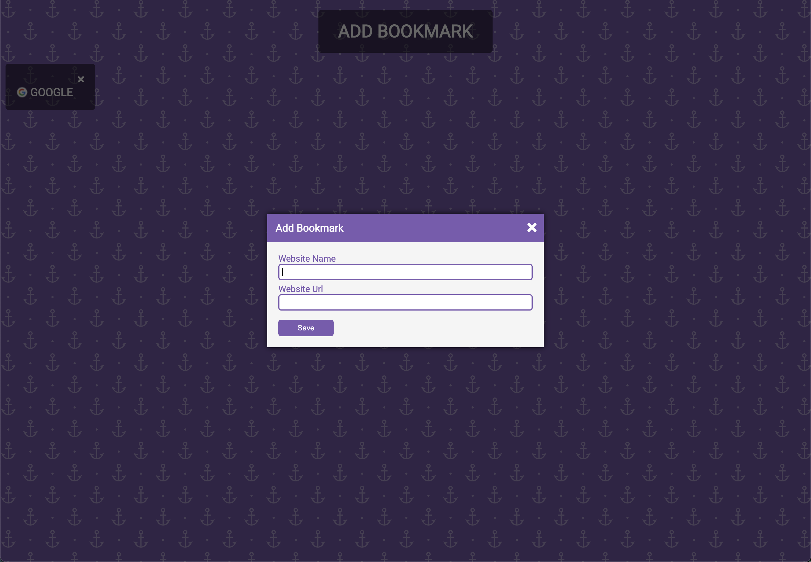

# Bookmark keeper

## URL

Check it out:

https://vasildimov98.github.io/10.bookmark-keeper/

## Description

Introducing Bookmark Keeper, my personal project powered by JavaScript. Say goodbye to scattered bookmarks and disorganized web pages. With Bookmark Keeper, you can effortlessly organize and manage all your favorite online resources in one convenient place.

This user-friendly web application allows you to easily save, categorize, and access your bookmarks with just a few clicks. Seamlessly add new bookmarks, assign tags or labels for easy searching, and enjoy a clutter-free browsing experience.

Never again waste time searching through endless browser bookmarks. Bookmark Keeper puts you in control, helping you stay organized and efficient. Experience the joy of having your favorite websites just a click away with Bookmark Keeper.

